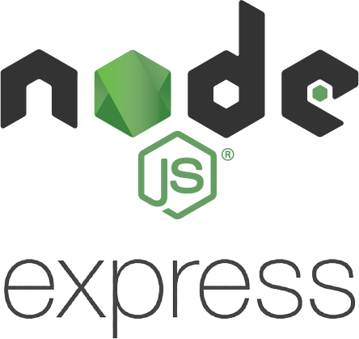
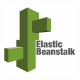

# West Buy Accordion Drawers
A collapsible drawer microservice of a Western-themed BestBuy.com clone providing customers access to a product's Overview, Specifications, and Reviews.

## Accordion Drawers Microservice
The Accordion Drawers provide potential West Buy customers with three main sections of product information (listed below). All sections were created using vanilla React, and styling was accomplished with raw CSS and minimal use of React Bootstrap components.

### Product Overview and Specifications
These sections allow a user to see product-specific information in a variety of categories as well as interact with "More Info" modals containing clarifying info for certain specs.

### Ratings/Reviews
This section allows a user to both view and filter customer reviews and a variety of rating/recommendation data for a given product.

 
 

## Stack

<table style="{empty-cells: hide}">
  <tr>
  </tr>
  <tr>
    <td align="center">Front-end</td>
    <td align="center">Back-end</td>
    <td align="center">Deployment</td>
  </tr>
  <tr>
    <!-- <td align="center"></td> -->
    <td align="center"></td>
    <td align="center"></td>
    <td align="center"></td>
  </tr>
  <tr>
    <!-- <td align="center"></td> -->
    <td align="center"></td>
    <td align="center"></td>
    <td align="center"></td>
  </tr>
</table>

## Contributors
[Collin Snyder](https://github.com/Collin-Snyder)
